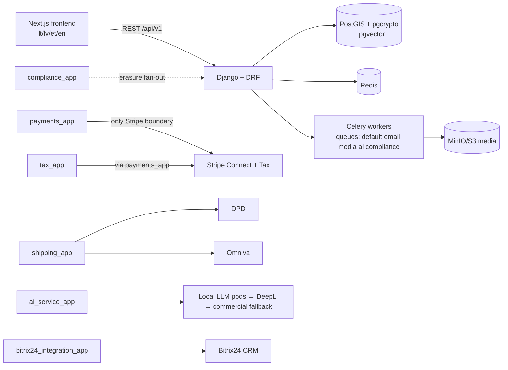

# jol-m-marketplace

Baltic-first B2C/B2B2C marketplace (LT · LV · EE · EN): seller onboarding with
KYC-lite/VIES validation, EU VAT OSS-aware checkout, parcel-locker shipping
(DPD/Omniva), and AI-assisted catalog translation with strict PII guardrails.

**Compliance targets:** GDPR (incl. Art. 17 erasure, Art. 20 portability, RoPA),
ISO 27001-aligned controls, SOC 2 Type II evidence readiness, PCI DSS SAQ-A
(card data never touches our systems — Stripe is the only payment boundary).

Licensed **AGPL-3.0** (see [LICENSE](LICENSE)). Network-use copyleft applies.

## Architecture (high level)



Design invariants (enforced in review, see `docs/architecture/01-modular-breakdown.md`):

1. `payments_app` is the **only** module importing the Stripe SDK.
2. Cross-app calls go through `services.py` — never another app's models/views/tasks.
3. AI work runs **only** in Celery (`ai` queue), never in the request path.
4. `openapi.yaml` and `frontend/src/lib/api/generated/` are CI artifacts — hand-edits fail CI.
5. Fail-closed: `GDPR_PROCESSING_HALTED=1` stops all mutating traffic (503).

## Quickstart

```bash
cp .env.example .env          # fill in values
make bootstrap                # venv + deps
make sysdeps                  # GDAL on the host (one-time, needs sudo)
make dev-up                   # full stack via docker-compose.dev.yml
make migrate && make seed
# Frontend: http://localhost:3000  ·  API schema: http://localhost:8000/api/schema/swagger/
```

Full developer guide: [CONTRIBUTING.md](CONTRIBUTING.md) ·
Vulnerability reporting: [SECURITY.md](SECURITY.md) ·
Decisions & ADRs: [docs/TECH_DECISIONS.md](docs/TECH_DECISIONS.md)
