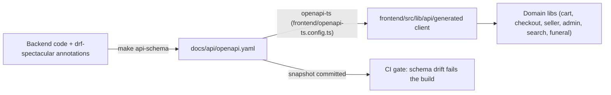
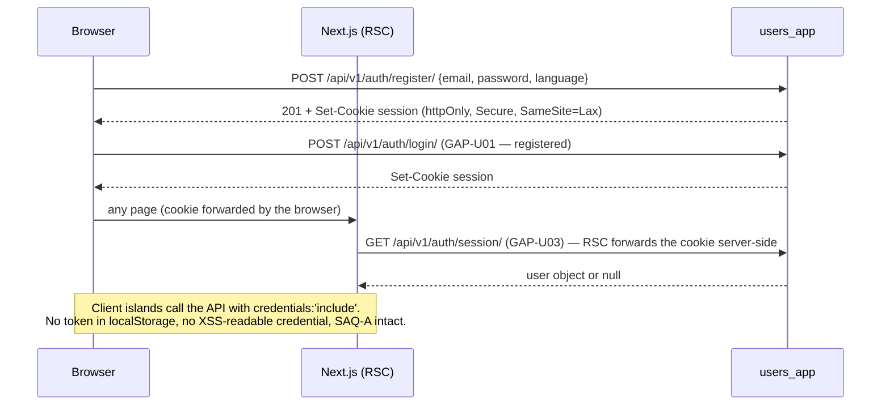

# JOL Marketplace — API Contract

**Version:** 1.0 · **Schema:** `docs/api/openapi.yaml` (generated — never hand-edited)
**Audience:** Backend and frontend contributors, integration auditors

## Table of Contents

1. [Contract Principles](#1-contract-principles)
2. [OpenAPI Generation Workflow](#2-openapi-generation-workflow)
3. [Authentication Scheme](#3-authentication-scheme)
4. [Error Handling Conventions](#4-error-handling-conventions)
5. [Rate Limiting Policies](#5-rate-limiting-policies)
6. [The Contract-Gap Registry](#6-the-contract-gap-registry)

---

## 1. Contract Principles

- **The OpenAPI document is the single source of truth.** The frontend
  client is *generated* from it; endpoints not in the schema do not exist
  for typed code.
- **Frontend and backend may ship at different velocities.** The platform's
  doctrine (ADR-0007) permits the frontend to ship against a *registered
  gap* — a missing endpoint with a `GAP-` id — rendering a sanctioned
  notice instead of silently faking data.
- **Payments have exactly one boundary.** Only `payments_app` speaks
  Stripe; internal payment endpoints are network-isolated and additionally
  authenticated (`internal_auth.py`).
- **Idempotency is a contract feature**, not an optimization: checkout
  accepts `Idempotency-Key`; webhooks deduplicate on Stripe event id
  (`core.IdempotencyRecord`, A-03).

## 2. OpenAPI Generation Workflow



Rules enforced by CI and review:

1. `make api-schema` regenerates **both** the YAML snapshot and the typed
   client; hand-editing either is a review blocker.
2. The committed snapshot is compared in CI — undocumented response shape
   changes fail the pipeline.
3. Endpoints that do not yet exist are **registered as gaps** (§6) rather
   than typed optimistically.

## 3. Authentication Scheme

**httpOnly session cookies** — the browser never sees the credential:



- **CSRF**: Django's double-submit token for cookie-authenticated mutations.
- **Roles**: `buyer` / `seller` / `admin` (parish accounts modeled as a
  buyer subtype). Enforcement is server-side on every request; UI redirects
  are cosmetic defense-in-depth only.
- **Logout** invalidates the session server-side and drops the local cart
  draft on identity change (no cross-user cart leak).

## 4. Error Handling Conventions

### Wire format

Errors follow DRF's structured body; the frontend normalizes them through
`ApiError.fromResponse(response, error)`:

```json
{ "detail": "Human-readable message", "field": ["specific issue"] }
```

### Frontend doctrine

| Status | Meaning | Frontend behavior |
|---|---|---|
| `404` / `405` / `501` | **Contract gap** (endpoint unimplemented) | `isContractPending(error)` → sanctioned `ContractGapNotice` with GAP-id — never fake data, never a scary error |
| `400` | Validation | Field-level messages mapped per form via Zod → server round-trip |
| `401` | Unauthenticated | Session-aware surfaces degrade to anonymous |
| `403` | Forbidden | Admin/seller gates redirect to a localized 403 page |
| `409` | Conflict (idempotency/state machine) | Show server message verbatim — never retry blindly |
| `429` | Throttled | Retry-after respected by the client wrapper |
| `5xx` | Outage | Calm retry surface; audit writes are fire-and-forget and never block the user action |

The gap-detection rule (`404|405|501`) is unit-tested; changing it is a
contract change requiring an ADR.

## 5. Rate Limiting Policies

Backend throttling (DRF `DEFAULT_THROTTLE_RATES`, `project/settings/base.py`):

| Scope | Rate | Notes |
|---|---|---|
| Anonymous | **60 req/min** | Covers catalog browsing for guests |
| Authenticated | **300 req/min** | Per user |
| Auth endpoints | Stricter per-route overrides recommended before public launch (registration, login, password reset) | Tracked in the MVP-remaining register |
| Webhooks | Stripe retry semantics — signature check first, then idempotent dedupe | Event id is the dedupe key |

Edge posture (Nginx): connection limiting on `/api/v1/auth/*`, request
size caps on media uploads (KYC ≤ 5 MB, listing images ≤ 2 MB each are
enforced client-side *and* server-side).

## 6. The Contract-Gap Registry

`frontend/src/lib/api/contract-gaps.ts` is the **public ledger** of every
endpoint the frontend needs but the backend has not yet shipped. Each entry
carries:

```ts
{ id: "GAP-S01", method: "GET", path: "/api/v1/search/?q=",
  ownerApp: "search_app", neededFor: "search results page: facets + pagination" }
```

- IDs match `^GAP-[A-Z]{1,2}\d{2,3}$` (enforced by unit test) and are
  grouped by owner app (U users, V sellers, P products, O orders, M admin,
  C compliance, S search, F funeral…).
- The registry currently holds **57 entries** — this number is the honest
  measure of MVP completion and feeds `docs/MVP_REMAINING_WORK.md`.
- When a backend endpoint lands, the corresponding frontend domain lib is
  re-typed against the generated client, the gap entry is deleted, and the
  e2e journey covering it is expected to go green.

**Nothing in the registry may be "resolved" with mock data in production
surfaces.** That is the core of ADR-0007 — sanctioned stubs over silent
fakes — and it is why grant reviewers can trust the UI screenshots: every
rendered product, seller, or order originates from the seeded database.

---

**Cross-references:** [ARCHITECTURE.md](./ARCHITECTURE.md) ·
[SECURITY.md](./SECURITY.md) · [TESTING.md](./TESTING.md) ·
ADR-0007 in `docs/TECH_DECISIONS.md`
