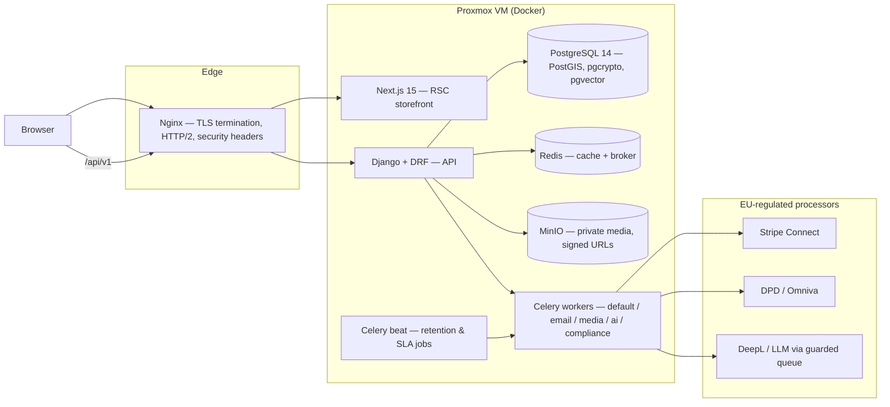
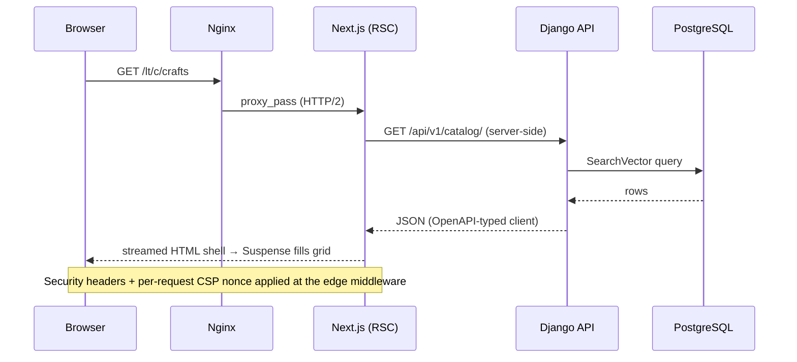
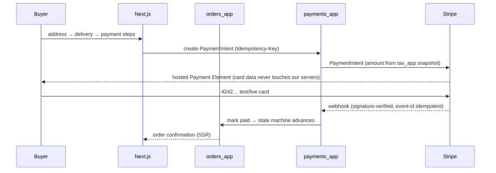
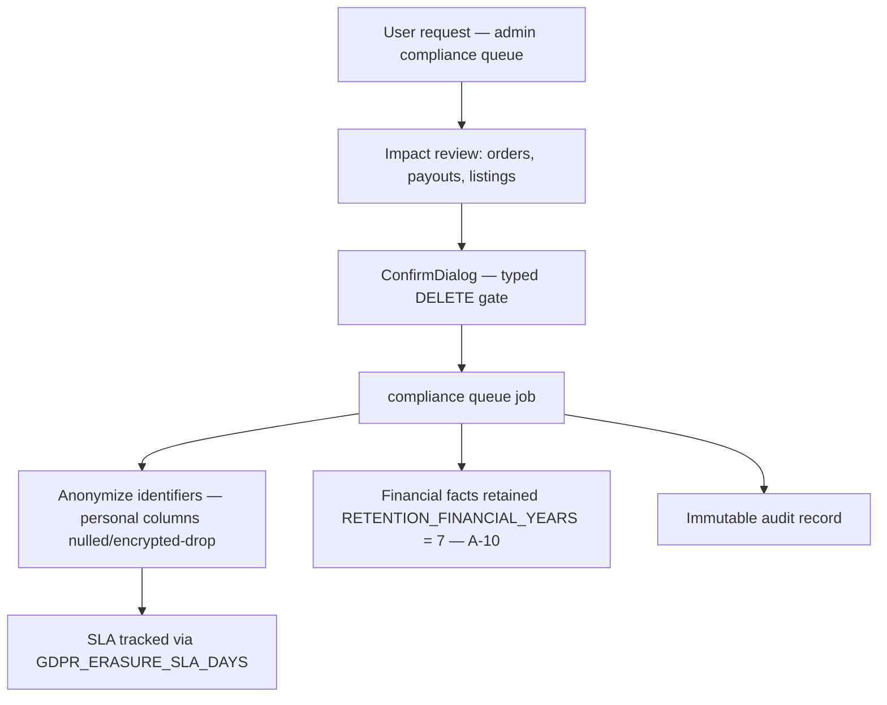
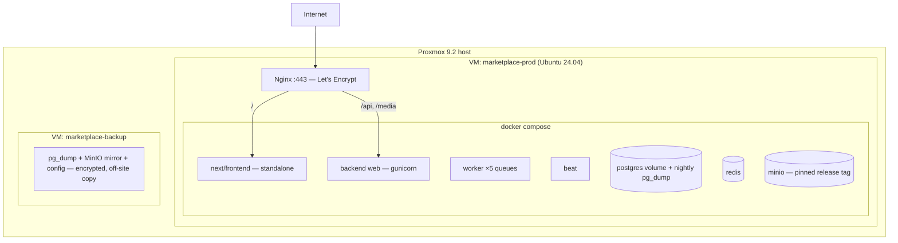

# JOL Marketplace — System Architecture

**Version:** 1.0 · **Status:** Final deliverable of the 100-day sprint
**Audience:** Technical auditors, grant reviewers, contributors

## Table of Contents

1. [Overview](#1-overview)
2. [Technology Stack & Rationale](#2-technology-stack--rationale)
3. [Module Breakdown](#3-module-breakdown)
4. [Data Flow Diagrams](#4-data-flow-diagrams)
5. [Security Architecture](#5-security-architecture)
6. [Deployment Architecture](#6-deployment-architecture)

---

## 1. Overview

JOL Marketplace is a Baltic-first B2C/B2B2C e-commerce platform serving
Lithuania, Latvia, and Estonia in four locales (`lt`, `lv`, `et`, `en`),
with a Catholic/faith vertical that includes a grief-aware funeral services
directory. The system is architected for **compliance-grade operation from
day one**: GDPR (Art. 15/17/20), PCI DSS SAQ-A, and an ISO 27001 / SOC 2
Type II posture.

Three principles govern the architecture:

- **Modular monolith with strict domain boundaries.** Eleven Django apps,
  each owning its models and exposing capabilities only through
  `services.py`. `payments_app` is the *only* Stripe importer; AI workloads
  run *only* on the dedicated Celery `ai` queue (ADR-0001).
- **Honest degradation over silent fakes.** Frontend surfaces whose backend
  contracts are not yet implemented render sanctioned notices keyed to a
  public contract-gap registry — never fabricated data (ADR-0007).
- **Compliance as architecture, not policy.** Consent gates script loading,
  field-level encryption protects PII at rest, erasure anonymizes rather
  than destroys financial records, and every moderation action is
  audit-logged.

## 2. Technology Stack & Rationale

| Layer | Choice | Rationale |
|---|---|---|
| Backend | **Django 5 + DRF** | Mature ORM with migrations-as-review-artifacts, battle-tested admin for ops, first-class security defaults; Python ecosystem fits Celery + AI tooling. |
| Frontend | **Next.js 15 (App Router, RSC)** | Server components keep the buyer storefront's JS budget minimal for our 50+ persona on modest hardware; streaming + Suspense give progressive rendering without Vercel-specific features. |
| Database | **PostgreSQL 14+ (PostGIS, pgcrypto, pgvector)** | PostGIS for seller/service geography; pgcrypto PGP path for searchable encrypted columns (ADR-0004); pgvector reserved for Phase-2 semantic search. |
| Async | **Celery + Redis** | Five isolated queues (`default`, `email`, `media`, `ai`, `compliance`) so an AI outage can never block order emails; compliance jobs run on their own queue and schedule. |
| Storage | **MinIO (dev) → S3-compatible (prod)** | Private-by-default signed URLs; no public buckets anywhere (ADR-0005). |
| Payments | **Stripe Connect (Express)** | PCI scope stays SAQ-A: card data enters only inside Stripe-hosted fields; platform commission applied server-side. |
| i18n | **next-intl (UI) + django-modeltranslation (catalog)** | UI chrome is static; catalog content is authored per listing. The two systems are deliberately never unified (ADR-0003). |
| Analytics | **Plausible (self-hosted), consent-gated** | No cookies, no fingerprinting, EU-hosted; nothing loads before explicit consent. |
| Observability | **OpenTelemetry (endpoint-driven opt-in) + Sentry** | Tracing exports only when `OTEL_EXPORTER_OTLP_ENDPOINT` is configured; imports are guarded (A-08). |
| License | **AGPL-3.0** | Organization policy; network-use copyleft acknowledged (ADR-0002). |

## 3. Module Breakdown

### Backend (Django apps)

| App | Responsibility | Notes |
|---|---|---|
| `core` | Shared kernel: encryption, idempotency, pagination, permissions, health | `EncryptedTextField` (Fernet/MultiFernet, fail-closed), role groups |
| `users_app` | Registration, sessions, roles | httpOnly cookie sessions |
| `sellers_app` | Seller profiles, KYC-lite, verification states | VIES validation hooks |
| `products_app` | Listings, categories, moderation states | Multilingual columns |
| `orders_app` | Order lifecycle state machine | Explicit transitions only |
| `payments_app` | **Sole Stripe boundary**: intents, webhooks, Connect | Internal-only endpoints with signed auth |
| `tax_app` | VAT OSS rules, rate snapshots | Stripe Tax call stays in `payments_app` (A-02) |
| `shipping_app` | DPD/Omniva courier + parcel-locker integration | |
| `search_app` | PostgreSQL `SearchVector` + GIN (Phase 1) | pgvector/OpenSearch behind same protocol (A-05) |
| `compliance_app` | Consent ledger, retention, erasure SLA | Beat-scheduled retention sweeps |
| `ai_service_app` | Catalog translation with PII guardrails | Runs only on `ai` queue |
| `bitrix24_integration_app` | CRM sync | Feature-flagged |

### Frontend (Next.js)

| Surface | Routes | Notes |
|---|---|---|
| Buyer storefront | `/`, `/c/[slug]`, `/p/[slug]`, `/cart`, `/checkout` | RSC + minimal client islands |
| Search | `/search`, command palette (Cmd/Ctrl+K) | 300ms debounce, explicit pagination |
| Seller | `/seller/onboarding`, `/seller/dashboard`, `/seller/listings/new` | Role-gated, `force-dynamic` |
| Admin | `/admin/*` (sellers, listings, compliance) | Role gate → 403; audit-emitting mutations |
| Funeral vertical | `/funeral-services`, `/funeral-services/[slug]` | Lead-gen only, `.theme-funeral` |
| Account | `/account/orders`, address book | |

## 4. Data Flow Diagrams

### 4.1 Catalog request (streaming RSC)

### 4.2 Checkout (PCI SAQ-A path)

### 4.3 Erasure (GDPR Art. 17)

## 5. Security Architecture

Full treatment in [SECURITY.md](./SECURITY.md); the architecture summary:

### Authentication flow

Sessions use **httpOnly, `SameSite=Lax` cookies** set by `users_app`. The
frontend never touches the session token from JavaScript: RSC pages forward
the cookie server-side; client islands call the API with
`credentials: "include"`. CSRF protection is Django's standard double-submit
token. Role gates (`buyer` / `seller` / `admin`) are enforced **server-side
on every request**, and additionally at the UI layer (redirect to `/403`) as
defense-in-depth only.

### Content Security Policy

CSP is built **per request** in Next middleware with a fresh cryptographic
nonce (`buildCsp` in `src/lib/security.ts`):

- `script-src 'self' 'nonce-…' https://js.stripe.com` — no inline scripts, no
  `unsafe-eval`; analytics origin appended only when consent infrastructure
  is configured.
- `frame-src` is exactly two origins: Stripe (payments) and OpenStreetMap
  (user-initiated funeral maps only).
- `frame-ancestors 'none'`, `object-src 'none'`, `base-uri 'self'`,
  `form-action 'self'` close clickjacking, plugin, and injection vectors.

### Cookie strategy

| Cookie | Type | Purpose |
|---|---|---|
| Session | httpOnly, Secure, SameSite=Lax | Authentication — unreadable by JS |
| CSRF token | readable | Django double-submit |
| Consent / cart / theme | localStorage (not cookies) | No cookie consent surface needed for first-party storage that carries no tracking; consent decisions themselves are versioned and audit-logged |

Zero third-party cookies exist anywhere in the platform; analytics is
cookie-less Plausible, gated behind explicit consent.

## 6. Deployment Architecture

Ratified target: **self-hosted Proxmox 9.2 VM running Docker** (no managed
cloud dependency — sovereignty and cost control for the grant period).

Operational details — Compose topology, TLS, backups, monitoring, and the
restore runbook — are in [DEPLOYMENT.md](./DEPLOYMENT.md); incident playbooks
live in `docs/runbooks/`.

---

**Cross-references:** [API_CONTRACT.md](./API_CONTRACT.md) ·
[SECURITY.md](./SECURITY.md) · [GDPR_COMPLIANCE.md](./GDPR_COMPLIANCE.md) ·
[TESTING.md](./TESTING.md) · ADRs in `docs/TECH_DECISIONS.md`
