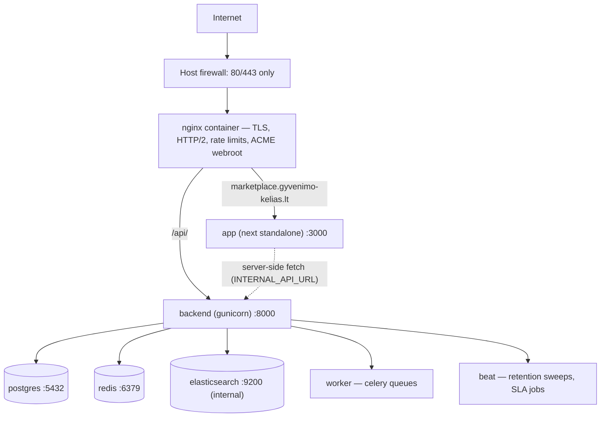

# JOL Marketplace — Self-Hosted Deployment Guide

**Version:** 2.0 · **Target:** Proxmox VE 9.2 → Ubuntu 24.04 VM → Docker Compose → containerized Nginx
**Audience:** Operators, DevOps reviewers
**Public origin:** `https://marketplace.gyvenimo-kelias.lt` (subdomain of the
organization domain `gyvenimo-kelias.lt` — a dot-subdomain, not a separate
registration).

## Table of Contents

1. [Topology Overview](#1-topology-overview)
2. [Proxmox VM Setup](#2-proxmox-vm-setup)
3. [Docker Compose Production Configuration](#3-docker-compose-production-configuration)
4. [Nginx Configuration](#4-nginx-configuration)
5. [SSL/TLS with Let's Encrypt](#5-ssltls-with-lets-encrypt)
6. [Backup and Disaster Recovery](#6-backup-and-disaster-recovery)
7. [Monitoring and Alerting](#7-monitoring-and-alerting)
8. [First-Launch Runbook](#8-first-launch-runbook)

---

## 1. Topology Overview

Deployment sovereignty is a hard requirement: **no managed-cloud
dependency**. The ratified topology is a Proxmox-VM-hosted Docker Compose
stack; every image is orchestrator-agnostic, so the topology can move
without code changes if the hosting decision ever changes.



Networks: `frontend` (nginx ⇄ app ⇄ backend web) and `backend`
(internal-only: Django tier ⇄ postgres/redis/elasticsearch). **Only
nginx publishes ports.**

## 2. Proxmox VM Setup

Reference specification (production):

| Resource | Value | Notes |
|---|---|---|
| vCPU | 4 | Burst OK; Celery concurrency is the scaling knob |
| RAM | 8 GB | PostgreSQL + Redis + Elasticsearch are the floor consumers |
| Disk | 120 GB SSD on ZFS | VM image 30 GB; volumes on a separate dataset for snapshots |
| OS | Ubuntu 24.04 LTS | Matches CI runner (`ubuntu-24.04`) |
| Network | Static public IP; DNS A/AAAA for `marketplace.gyvenimo-kelias.lt` | |
| Backups | Proxmox vzdump nightly → second VM/site (§6) | |

```bash
# Inside the VM
sudo apt install docker.io docker-compose-v2 certbot
sudo usermod -aG docker $USER
```

Operational rules:

- **Pin every image tag in production** — `:latest`-style floats are
  permitted in dev compose only (ADR-0005).
- Secrets live in the root-only `.env.prod` beside the compose file; the
  repository's `scripts/check_no_secrets.sh` (Gitleaks-backed) guards
  against committing them.
- `DJANGO_ENV=production`, `DJANGO_DEBUG=false`, `DJANGO_ALLOWED_HOSTS`
  exact-match only — the backend refuses to boot otherwise.

## 3. Docker Compose Production Configuration

Services in `docker-compose.prod.yml`:

| Service | Image/Build | Notes |
|---|---|---|
| `nginx` | `nginx:1.27-alpine` | Only published ports (80/443); envsubst template |
| `app` | `frontend/Dockerfile` → runner (standalone) | `NEXT_PUBLIC_*` baked at BUILD via args |
| `backend` | `backend/Dockerfile` → runtime (gunicorn) | `/api/` passthrough; health-gated |
| `worker` | same image, `celery worker` | AI outage cannot starve order emails |
| `beat` | same image, `celery beat` | Retention sweeps, erasure SLA checks |
| `postgres` | `postgres:16-alpine` | PostGIS via `backend/db/init-extensions.sql` image |
| `redis` | `redis:7-alpine` | AOF + LRU |
| `elasticsearch` | `elasticsearch:8.15.5` | Single-node, internal network only |

```bash
cp .env.prod.example .env.prod   # fill secrets (see §8)
scripts/deploy.sh                # tag → build → migrate → health gate → smoke
```

`scripts/deploy.sh` runs Django migrations **before** traffic switches,
health-gates the app, verifies security headers, and supports
`--rollback` to the previous tagged image.

## 4. Nginx Configuration

The production edge is the **containerized** nginx — nothing runs on the
host except Docker. `nginx/nginx.prod.conf` is mounted as an envsubst
template; the official image renders `${DOMAIN}` and `${BACKEND_UPSTREAM}`
from `.env.prod` at container start. It provides:

- TLS termination + HTTP/2, ACME webroot location, HTTP→HTTPS redirect
- `/api/` passthrough to the Django tier (tightest rate limit)
- immutable caching for `/_next/static/`, gzip, JSON access logs
- the static security-header floor (the app adds the per-request CSP
  nonce the edge cannot know)

Django admin (ADR-0006) is **unreachable from the edge by construction**:
nginx proxies only `/api/` to Django, so `/admin/` (the micro-CMS for
hero/categories/curation) is operable exclusively via
`docker compose exec backend …` on the VM.

## 5. SSL/TLS with Let's Encrypt

TLS bootstrap (first boot needs *some* cert for nginx to start):

```bash
mkdir -p ssl certbot-webroot logs/nginx
openssl req -x509 -nodes -newkey rsa:2048 -days 1 \
  -subj "/CN=marketplace.gyvenimo-kelias.lt" \
  -keyout ssl/privkey.pem -out ssl/fullchain.pem

docker compose -f docker-compose.prod.yml --env-file .env.prod up -d nginx

# Real cert via the ACME webroot mounted into the nginx container:
sudo certbot certonly --webroot -w ./certbot-webroot \
  -d marketplace.gyvenimo-kelias.lt
sudo cp /etc/letsencrypt/live/marketplace.gyvenimo-kelias.lt/fullchain.pem ssl/
sudo cp /etc/letsencrypt/live/marketplace.gyvenimo-kelias.lt/privkey.pem ssl/
docker compose -f docker-compose.prod.yml exec nginx nginx -s reload
```

Renewal (host cron, twice daily):

```cron
0 3,15 * * * certbot renew -q --webroot -w /opt/jol/certbot-webroot && cp /etc/letsencrypt/live/marketplace.gyvenimo-kelias.lt/{fullchain.pem,privkey.pem} /opt/jol/ssl/ && docker compose -f /opt/jol/docker-compose.prod.yml exec -T nginx nginx -s reload
```

- HSTS is emitted by the application (`max-age=63072000;
  includeSubDomains; preload`); the edge mirrors it as defense-in-depth.
- Certificate renewal failures page the on-call via the monitoring hook
  (§7).

## 6. Backup and Disaster Recovery

| Asset | Method | Cadence | Restore test |
|---|---|---|---|
| PostgreSQL | `pg_dump -Fc` → encrypted archive off-VM (`scripts/backup.sh`) | Nightly + pre-deploy | Quarterly |
| Media (S3/MinIO) | mirror to backup VM | Nightly | Quarterly |
| `.env.prod` / compose / nginx config | Encrypted vault copy | On change | With every DR drill |
| Full VM | Proxmox vzdump snapshot | Nightly, 7-day retention | Monthly |

**RPO ≤ 24 h, RTO ≤ 4 h.** The step-by-step restore procedure is codified
in `docs/runbooks/restore-from-backup.md`; companion incident playbooks
exist for Stripe webhook failure and AI outage.

## 7. Monitoring and Alerting

| Signal | Source | Alert threshold |
|---|---|---|
| Liveness | nginx `/healthz` + app + backend healthchecks | 2 consecutive failures |
| Error rate | Sentry (`SENTRY_DSN`) | New error class in `payments_app` or `compliance_app` → immediate |
| Traces/metrics | OpenTelemetry → `OTEL_EXPORTER_OTLP_ENDPOINT` (opt-in) | Worker queue depth > 1000 for 10 min |
| Queue health | Celery inspect per queue | `compliance` queue stalled > SLA window |
| Disk/cert | Proxmox guest agent + certbot cron | Disk > 80%; cert < 14 days |
| Retention jobs | Beat schedule audit log | Missing sweep run > 25 h |

Alert routing targets the operator channel defined in `.env.prod`
(Bitrix24 webhook when enabled); on-call expectations and severity
definitions live in [SECURITY.md §6](./SECURITY.md#6-incident-response-plan).

## 8. First-Launch Runbook

1. **DNS** — at the `gyvenimo-kelias.lt` registrar, create:
   `A marketplace → <VM public IPv4>` and `AAAA → <IPv6 if present>`.
   Verify with `dig +short marketplace.gyvenimo-kelias.lt`.
2. **Env** — `cp .env.prod.example .env.prod`; generate and fill
   `POSTGRES_PASSWORD`, `DJANGO_SECRET_KEY` (≥50 chars),
   `FIELD_ENCRYPTION_KEY` (Fernet), and keep `DATABASE_URL` consistent.
   Stripe TEST keys first; live keys only at money-flow go-live.
3. **TLS bootstrap** — §5 (self-signed → up → certbot → reload).
4. **Deploy** — `scripts/deploy.sh` (builds both images, migrates, gates).
5. **Operator account** — the micro-CMS (hero banner, category rail,
   featured listings) lives in Django admin:
   `docker compose -f docker-compose.prod.yml exec backend python manage.py createsuperuser`
   (admin is VM-local only, §4).
6. **Seed vs real content** — do NOT run the demo seed in production;
   create real categories/listings via admin/services.
7. **Smoke** — `curl -fsI https://marketplace.gyvenimo-kelias.lt/` shows
   HSTS + CSP; home renders curated rails; `/api/v1/catalog/home/` 200.
8. **Backups + monitoring** — wire §6/§7 before announcing launch.

Launch-scope honesty: at first launch the public surface is catalog
browse (home/categories/featured), product detail as it lands, and buyer
registration. Cart/checkout, search ranking, and the seller dashboard are
registered contract gaps shipped incrementally — pages render sanctioned
"being prepared" states, never fake data (ADR-0007).

---

**Cross-references:** [ARCHITECTURE.md](./ARCHITECTURE.md) ·
[SECURITY.md](./SECURITY.md) · runbooks in `docs/runbooks/`
