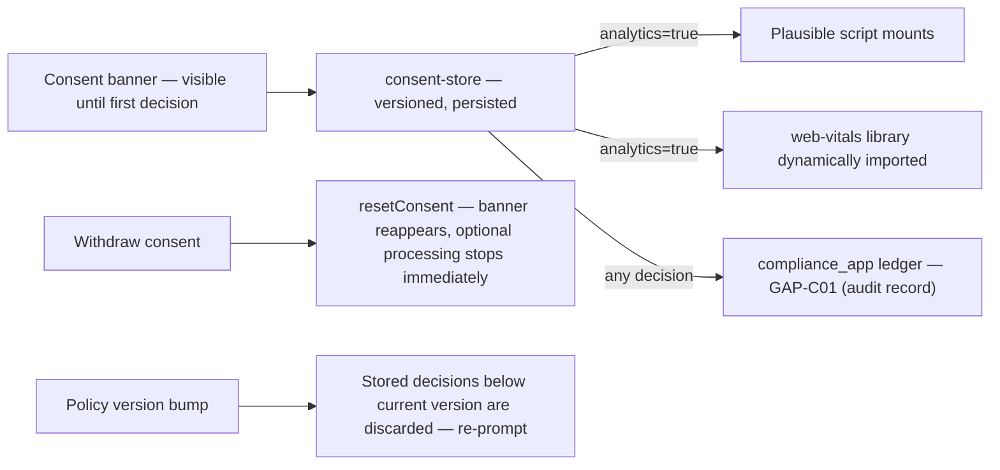

# JOL Marketplace — GDPR Compliance Documentation

**Version:** 1.0 · **Roles:** Journey of Life (controller) · processors listed in §1
**Audience:** Data-protection auditors, grant compliance reviewers

## Table of Contents

1. [Data Processing Inventory](#1-data-processing-inventory)
2. [Consent Management Architecture](#2-consent-management-architecture)
3. [User Rights Implementation (Art. 15, 17, 20)](#3-user-rights-implementation-art-15-17-20)
4. [Data Retention Policies](#4-data-retention-policies)
5. [Cross-Border Data Transfer — EU-Only Posture](#5-cross-border-data-transfer--eu-only-posture)

---

## 1. Data Processing Inventory

| Category | Data items | Legal basis | Storage | Protection |
|---|---|---|---|---|
| Account | email, name, password hash, locale preference | Contract (Art. 6(1)(b)) | PostgreSQL | Fernet-encrypted PII columns (ADR-0004) |
| Seller KYC | business registration data, identity documents | Legal obligation + contract | S3-compatible, **private bucket**, signed URLs | Uploaded server-side direct; never processed client-side; access logged |
| Orders | shipping address, phone, order lines | Contract | PostgreSQL | Address fields encrypted at rest; financial facts retained per §4 |
| Payments | Stripe customer reference — **never card data** | Contract | payments_app only | PCI SAQ-A boundary |
| Consent records | category choices, timestamp, policy version | Legal obligation (Art. 7(1)) | compliance_app ledger + client copy | Versioned, append-only |
| Funeral consultation leads | name + one contact method (deliberately minimal) | Consent / pre-contractual request | GAP-F01 backend; until then nothing is stored | Data-minimized by design — the form structurally cannot collect more |
| Analytics | page views only (Plausible, cookie-less) | Consent | Self-hosted Plausible | No IPs stored beyond the aggregation window |
| Logs / traces | request metadata — **no PII fields logged** | Legitimate interest (security) | Sentry / OTEL | Scrubbed at the SDK boundary |

**Data minimization examples baked into code:** recent-searches storage
holds query text only (capped at 5 entries); the funeral consultation form
requires name + *one* contact method; search queries never enter page URLs.

## 2. Consent Management Architecture

Implementation facts:

- **Nothing optional loads before an explicit decision.** Analytics,
  marketing pixels, and Core-Web-Vitals measurement all gate on the
  `analytics`/`marketing` flags; the store starts undecided.
- Decisions carry a **policy version** (`CONSENT_VERSION`); changing the
  policy wording bumps the version and re-prompts every visitor.
- Each decision is posted to the backend consent ledger (GAP-C01) for the
  Art. 7(1) demonstrability requirement; the client copy remains effective
  if the ledger endpoint is unavailable (never blocking the user).
- **Withdrawal is immediate**: `resetConsent()` clears the choices and
  optional scripts stop on the next navigation; the web-vitals reporter
  additionally re-checks consent at every metric send.
- UI journeys affected: banner, preferences manager, and consent history —
  targeted at WCAG **AAA**.

## 3. User Rights Implementation (Art. 15, 17, 20)

The admin **Compliance Requests** queue (`/admin/compliance`) is the
operational surface; every action is audit-logged (GAP-M09).

| Right | Flow |
|---|---|
| **Art. 15 — Access** | Request enters the queue → operator verifies identity → export generated (GAP-C02) → secure download link → marked fulfilled |
| **Art. 17 — Erasure** | Impact review (orders, payouts, active listings) → `ConfirmDialog` with typed `DELETE` gate → anonymization job on the compliance queue → SLA tracked via `GDPR_ERASURE_SLA_DAYS` |
| **Art. 20 — Portability** | Machine-readable export of account + orders (GAP-C02) — same export pipeline as access |

**Erasure doctrine (A-10): anonymize, don't destroy.** Personal identifiers
are removed; financial facts survive for `RETENTION_FINANCIAL_YEARS` =
**7 years** (statutory accounting), with the link to the person severed.
This trade-off is documented to users at the point of request
(`gdprNotice` microcopy at checkout, consent manager wording).

## 4. Data Retention Policies

| Data | Retention | Mechanism |
|---|---|---|
| Sessions | Browser session + configured expiry | Django session engine |
| Unfulfilled carts (anonymous) | Local only; cleared on identity change | Client store |
| Orders & invoices | 7 years (`RETENTION_FINANCIAL_YEARS`) | `compliance_app/retention.py` sweep on Celery beat |
| Erased accounts | Identifiers anonymized immediately; financial skeleton kept 7 years | Compliance queue job |
| Consent records | Kept as the compliance ledger (outlives the account it documents) | Append-only |
| KYC documents | Until verification decision + statutory period, then scheduled deletion | Media queue + retention sweep |
| Analytics | Aggregations only; raw views expire in the Plausible window | Self-hosted config |
| Backups | 7-day VM snapshots; 30-day encrypted DB dumps | DEPLOYMENT.md §6 |

Retention sweeps are **monitored**: a missed sweep raises an alert
(DEPLOYMENT.md §7), because a retention failure is itself a compliance
event.

## 5. Cross-Border Data Transfer — EU-Only Posture

The platform operates an **EU-data-residency-first** policy:

| Processor | Purpose | Residency posture |
|---|---|---|
| Proxmox self-hosted VM | Primary hosting | EU (organization's own infrastructure) |
| Stripe (EU acquirer entity) | Payments | EU data residency for covered data |
| DPD / Omniva | Shipping & lockers | Baltic/EU operators |
| DeepL | Catalog translation | EU processor; text sent only after PII guardrail filtering on the `ai` queue |
| Self-hosted LLM (`AI_SELFHOSTED_*`) | Translation fallback | On our infrastructure — no transfer at all |
| Plausible | Analytics | Self-hosted — no transfer |
| Sentry / OTEL | Error reporting | Endpoint configured to EU/self-hosted collectors (`OTEL_EXPORTER_OTLP_ENDPOINT`) |

Rules:

1. No processor may be added without a data-processing agreement and an
   entry in the inventory above.
2. `AI_PII_FILTER_ENABLED` gates every AI-bound payload; the guardrail
   module (`ai_service_app/guardrails.py`) is codeowner-protected.
3. Any future transfer outside the EU requires SCCs/adequacy review and an
   ADR — the MVP ships without such transfers.

---

**Cross-references:** [SECURITY.md](./SECURITY.md) ·
`docs/COMPLIANCE_MATRIX.md` · A-10 in `docs/ASSUMPTIONS.md` ·
`compliance_app/retention.py`
