# Grant Application — JOL Marketplace

**Project title:** JOL Marketplace — A GDPR-native, self-hosted European
marketplace for ecclesiastical goods and grief-aware funeral services
**Acronym:** JOL-M · **Duration:** 100 days · **Licence of outcome:** AGPL-3.0
**Companion narrative:** [GRANT_SUBMISSION.md](GRANT_SUBMISSION.md) ·
one-page overview: [EXECUTIVE_SUMMARY.md](EXECUTIVE_SUMMARY.md)

## 1. Objectives

**Primary — launch a production MVP (Day 100).**
A buyer storefront (catalog, search, cart, Stripe checkout), seller
onboarding with KYC-lite and Connect payouts, an admin moderation
backoffice with a GDPR compliance queue, and the grief-aware funeral
directory — deployed self-hosted with backup, monitoring, and rollback.

**Secondary — Baltic expansion base.**
LT/LV/EN live at launch with ET content-ready; architecture proven ready
for EU-wide rollout (see [POST_MVP_ROADMAP.md](POST_MVP_ROADMAP.md)).

## 2. Work Packages

| WP | Name | Window | Deliverables | Acceptance criteria |
| --- | --- | --- | --- | --- |
| **WP1** | Foundation | Days 1–15 | Monorepo, CI/CD, Docker topology, design tokens, i18n skeleton | CI green on first merge; `make dev-up` boots full stack; 4 locales routable; ADR registry seeded |
| **WP2** | Buyer core | Days 16–40 | Catalog RSC pages, product detail, cart, auth (2FA-ready), consent | Catalog streams under LCP budget; cart persists across sessions; consent gates all analytics; axe-clean |
| **WP3** | Transaction | Days 41–60 | Stripe checkout (SAQ-A), orders, tax (VAT OSS-aware), shipping (DPD/Omniva) | Test-mode purchase completes end-to-end; webhook replay idempotent; e2e checkout spec green |
| **WP4** | Seller & admin | Days 61–78 | Seller onboarding (KYC-lite/VIES), listings, moderation backoffice, GDPR queue (Art. 15/17/20) | Onboarding completes with Connect payouts; moderation actions audited; erasure executes across all apps within SLA |
| **WP5** | Funeral & search | Days 79–90 | Funeral directory (no prices), faceted search shell, performance hardening | Directory grief-audited (no dark patterns); search degrades sanctioned per contract-gap registry; CWV budgets green |
| **WP6** | QA & deployment | Days 91–100 | Security hardening, a11y audit, production deploy scripts, documentation package | Pen-test-readiness checklist complete; deploy/backup/monitoring scripts shellcheck-clean; this package delivered |

**Dependencies:** WP2→WP3 (cart feeds checkout); WP1 gates all; WP6 runs
continuously with a hard window at the end.

## 3. Timeline (100 days)

```mermaid
gantt
    title JOL Marketplace — 100-day sprint
    dateFormat  X
    axisFormat  Day %s
    section WP1 Foundation
    Infra, CI/CD, design system       :0, 15
    section WP2 Buyer core
    Catalog, cart, auth, consent      :15, 40
    section WP3 Transaction
    Checkout, orders, shipping        :40, 60
    section WP4 Seller & admin
    Onboarding, moderation, GDPR      :60, 78
    section WP5 Funeral & search
    Directory, search, performance    :78, 90
    section WP6 QA & deploy
    Hardening, audit, docs            :90, 100
```

| Milestone | Day | Evidence |
| --- | --- | --- |
| M1 — stack boots, CI gates live | 15 | Merge of foundation PR |
| M2 — first browse-to-cart session | 40 | Buyer e2e suite green |
| M3 — first test-mode payment | 60 | Checkout e2e + webhook idempotency test |
| M4 — seller earns a payout | 78 | Onboarding e2e + Connect flow |
| M5 — CWV budgets green | 90 | Lighthouse CI report |
| M6 — production-ready package | 100 | This document + deploy runbook |

## 4. Budget (indicative, EUR)

| Category | Item | Amount | Notes |
| --- | --- | --- | --- |
| Personnel | Full-stack engineering (100 d × 2 FTE) | 64,000 | Dominant cost; grant co-financed |
| Personnel | Design/a11y audit (part-time) | 8,000 | WCAG AA/AAA verification |
| Personnel | Compliance counsel review (GDPR, PCI scoping) | 6,000 | Fixed-fee review of matrix |
| Infrastructure | Proxmox VM hosting (12 mo) | 3,600 | Self-hosted; replaces SaaS fees (ADR-0012) |
| Infrastructure | TLS certs, backups storage, CI runners | 900 | |
| Third-party | Stripe fees (test + launch-period volume) | 1,500 | No fixed cost; usage-based |
| Third-party | DeepL API (catalog translation) | 1,200 | Volume-capped; self-hosted fallback exists |
| Third-party | DPD/Omniva integration sandboxes | 0 | Partner programs |
| Assurance | Third-party penetration test | 5,000 | Annual; first before public launch |
| Contingency | ~8% | 7,200 | |
| **Total** | | **97,400** | |

## 5. Risk Register

| # | Risk | Class | P | I | Mitigation |
| --- | --- | --- | --- | --- | --- |
| R1 | Backend endpoint gaps block frontend journeys | Technical | Occurred | Medium | Contract-gap registry + sanctioned degradation (ADR-0007); 11 gaps tracked, none faked |
| R2 | Stripe webhook delivery failures | Technical | M | High | Signature verification, idempotent state machine, replay runbook |
| R3 | CWV regression on 4G | Technical | M | Medium | CI budget fails builds; runtime LCP test; bundle gate |
| R4 | Funeral-vertical regulatory drift | Regulatory | L | High | Lead-gen-only posture (ADR-0017); counsel review; per-state check before enablement |
| R5 | GDPR breach via logs/analytics | Regulatory | L | Critical | PII scrubber + redaction pipeline; no-console enforcement; consent gating; kill switch |
| R6 | Single-VM availability | Technical | M | Medium | Backups with restore drills; health-gated deploys; scaling plan documented |
| R7 | Low seller liquidity at launch | Market | M | High | Anchor parish suppliers pre-launch; funeral-home directory as traffic magnet |
| R8 | Grant timeline overrun | Schedule | M | Medium | WP gates with scope trim rules: compliance > commerce > cosmetics |

## 6. Success Metrics (12-month horizon)

| Metric | Target | Measurement |
| --- | --- | --- |
| Registered buyers | 5,000 | Backend users (consented) |
| Monthly transactions | 300 by M12 | Orders state machine |
| Sellers onboarded | 50 (incl. 10 funeral homes) | Verified seller count |
| GMV | €120k annualized run-rate | Stripe Connect volume |
| Core Web Vitals | ≥ 75th percentile "Good" on all metrics | Field data via consent-gated collector |
| Compliance SLA | 100% erasure requests within 30 days | compliance_app audit log |

---

*Acceptance evidence lives with each deliverable: CI reports, e2e traces,
Lighthouse artifacts, and this documentation package.*
