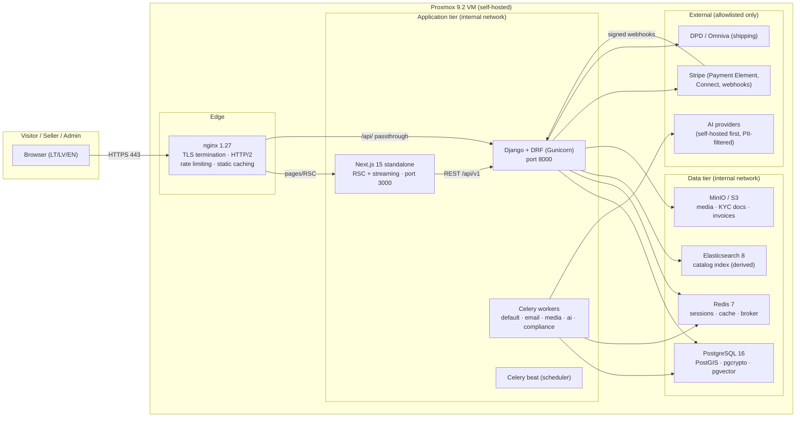
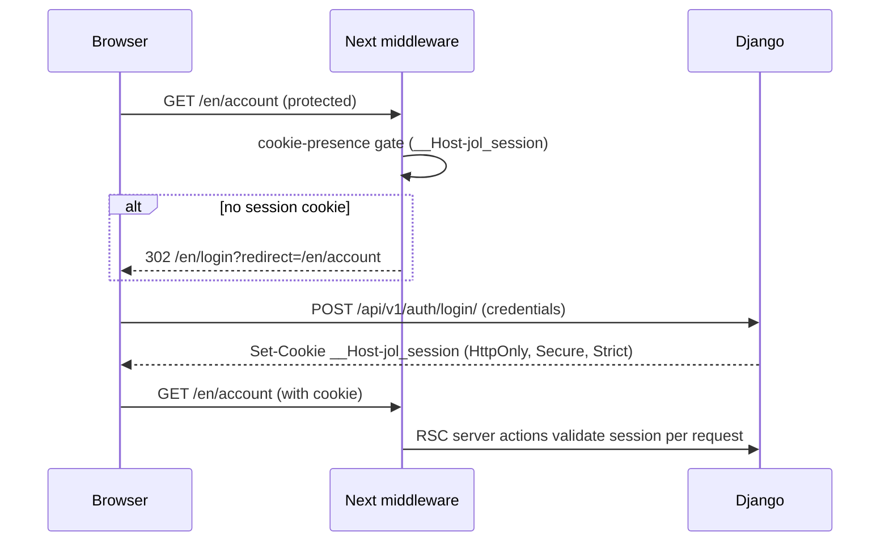
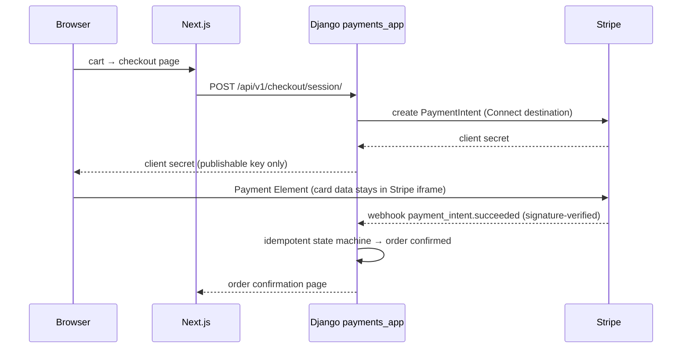

# Technical Specification

**Scope:** System architecture, data flows, API contract, state boundaries,
and caching strategy. Security controls: [SECURITY_POSTURE.md](SECURITY_POSTURE.md) ·
performance engineering: [PERFORMANCE_REPORT.md](PERFORMANCE_REPORT.md) ·
decisions: [ARCHITECTURE_DECISION_RECORDS.md](ARCHITECTURE_DECISION_RECORDS.md).

## 1. System Architecture

**Network isolation:** only nginx publishes ports. The application and data
tiers run on `internal: true` Docker networks (`docker-compose.prod.yml`).

## 2. Data Flows

### 2.1 Authentication & session

### 2.2 Catalog browse (streaming)

Home/category pages are server components: the shell renders immediately;
Hero, Categories, and Featured stream from independent Suspense boundaries
with CLS-safe skeletons. No `await` blocks the page shell — sections resolve
in parallel (see `src/app/[locale]/page.tsx`).

### 2.3 Checkout (PCI SAQ-A)

### 2.4 Search

Query → `search_app` → Elasticsearch (facets, multilingual). The ES index
is **derived**: a Celery indexer syncs from PostgreSQL, which remains the
source of truth. Until backend endpoints land, the frontend renders
sanctioned unavailable states via the contract-gap registry (ADR-0007) —
never fake data.

### 2.5 Compliance (erasure / portability)

Art. 17 requests enter the admin compliance queue; `compliance_app`
traverses all owning apps (users, orders, sellers, files), applies the
30-day SLA, and writes an audit record. Retention for financial data
follows the 7-year tax-law window before anonymization.

## 3. API Contract Summary

- **Style:** REST, JSON; generated OpenAPI 3.1 snapshot at
  `docs/api/openapi.yaml` (drf-spectacular) — regenerate with `make api-schema`,
  never hand-edit.
- **Versioning:** path prefix `/api/v1/`; breaking changes require `/v2`
  with a deprecation window.
- **Client:** `openapi-fetch` bound to generated `paths` types
  (`frontend/src/generated/api`) — drift is caught by `npm run api:drift`.
- **Contract gaps:** endpoints the frontend needs but the backend has not
  shipped are registered in `frontend/src/lib/api/contract-gaps.ts`
  (GAP-Pxx/Sxx/Lxx/Axx…) and rendered as sanctioned degradation states.
- **Errors:** DRF `detail`/field shapes map to typed frontend errors
  (`ApiError`, `ValidationError`, `PermissionError`); users see friendly
  copy + a trace ID, never internals.

## 4. State Management Boundaries

| State | Owner | Mechanism | PII? |
| --- | --- | --- | --- |
| Catalog, orders, users, sellers | Django (PostgreSQL) | REST API + server components | Yes — encrypted where required |
| Sessions | Django + Redis | `__Host-` httpOnly cookies | No identifiers client-side |
| Cart contents | Zustand (`cart-store`) | localStorage (IDs + quantities only) | No |
| Consent choices | Zustand (`consent-store`) | localStorage (consent proof) | No |
| Theme / locale prefs | Zustand + `jol_locale` cookie | localStorage/cookie | No |
| Checkout identity & addresses | Django session | Server actions at submit | Yes — never client-persisted |

**Rule:** anything that identifies a person lives server-side; client stores
hold identifiers and preferences only (ADR-0015, GDPR Art. 25).

## 5. Caching Strategy

| Layer | Technology | Policy |
| --- | --- | --- |
| Immutable hashed assets (`/_next/static/`) | nginx | 1 year, `immutable`, no access log |
| Optimized images (`/_next/image`) | sharp via Next optimizer + nginx | 1 day + `stale-while-revalidate=604800` |
| HTML pages | Next.js (static generation where session-free; `force-dynamic` where session-gated) | Per-route |
| Sessions & hot catalog | Redis | TTL aligned to session (14d) / catalog freshness |
| Client server-state | TanStack Query | SWR semantics with bounded GC; consent-gated mutations |
| Search index | Elasticsearch | Derived, rebuilt on demand from PostgreSQL |

Edge headers set `Cache-Control` conservatively for API responses
(`no-store` for probes; short TTLs for catalog reads).

---

*Deployment topology detail: [DEPLOYMENT.md](DEPLOYMENT.md) · sequence
diagrams: `docs/architecture/` · ERD: `docs/architecture/06-database-erd.md`.*
