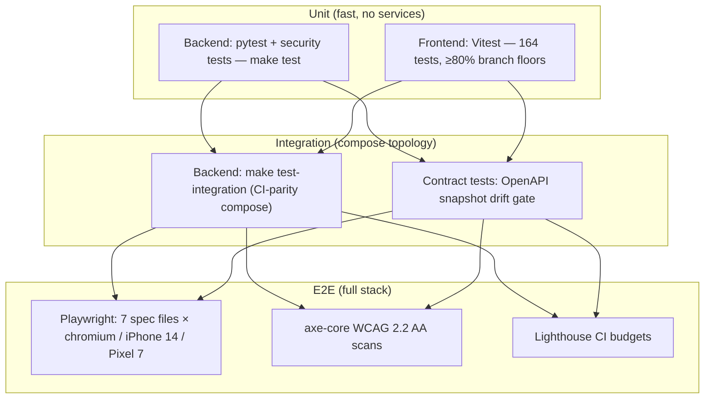

# JOL Marketplace — Testing Documentation

**Version:** 1.0 · **Suite state:** 164 frontend unit tests · 45 e2e scenarios × 3 device projects
**Audience:** QA reviewers, CI maintainers, auditors

## Table of Contents

1. [Testing Strategy](#1-testing-strategy)
2. [CI/CD Pipeline](#2-cicd-pipeline)
3. [Performance Budgets](#3-performance-budgets)
4. [Accessibility Testing](#4-accessibility-testing)
5. [Security Testing](#5-security-testing)

---

## 1. Testing Strategy

### Unit

- **Frontend** (`frontend/tests/unit/`, Vitest): domain libraries are the
  coverage focus — cart, checkout, seller, admin, funeral, search, consent,
  security headers. Aggregate thresholds: **80% branches / statements**,
  with each compliance-critical module individually above that floor
  (e.g. search 95.7%, admin 82.8%, seller 81.8% branches at last run).
- **Backend** (`backend/tests/`): unit + security suites runnable without
  external services (`make test`).
- Test-side discipline: no network, mocked API client, deterministic
  fixtures; coverage of *error paths* (contract-gap degradation, storage
  failures) is mandatory, not incidental.

### Integration

- `make test-integration` runs the backend against the CI-parity compose
  topology (`docker-compose.test.yml`).
- The OpenAPI snapshot is committed; CI fails on undocumented drift
  (`make api-schema` is the only sanctioned regeneration path).

### End-to-end (`frontend/e2e/`)

| Spec | Coverage |
|---|---|
| `buyer-journey.spec.ts` | Browse → cart → drawer; authenticated checkout incl. Stripe test card `4242 4242 4242 4242`; search results + empty state |
| `seller-journey.spec.ts` | Register → onboarding wizard → KYC upload (fixture image) → listing → dashboard |
| `funeral-journey.spec.ts` | Theme tokens, consultation flow, **and the no-commerce contract** (no Stripe frames, no cart/buy CTAs) |
| `accessibility.spec.ts` | axe-core on home, category, product, search, cart, checkout, funeral |
| `gdpr.spec.ts` | Reject-all blocks Plausible; accept-analytics mounts it |
| `performance.spec.ts` | Category grid LCP < 2000ms via PerformanceObserver |
| `smoke.spec.ts` | All launch locales render — the CI smoke gate |

Practices: no hardcoded waits (auto-waiting only); unique stamped test
accounts per run; API-based auth setup; failures leave screenshots,
retained video, and trace for the retry path. **Journey tests fail loudly
against unimplemented contract gaps** (with the GAP-id in the error)
rather than skipping — the suite doubles as a contract-completion meter.

## 2. CI/CD Pipeline

`.github/workflows/ci.yml` gates, in order:

1. **Backend**: ruff (format+lint), mypy, pytest (≥80% coverage floor).
2. **Frontend**: `npm ci` → typecheck (tsc) → ESLint → Prettier check →
   Vitest coverage → `next build`.
3. **Contract**: OpenAPI snapshot comparison.
4. **Secrets**: Gitleaks scan (repo-wide).
5. **Lighthouse CI** (`lighthouserc.js`): production build served locally;
   mobile-emulated runs assert **error-level** budgets for LCP/CLS/TBT/
   Speed-Index; `scripts/lighthouse-budget.json` adds resource budgets —
   breach fails the pipeline.
6. **Playwright smoke** (`smoke.spec.ts`) against the built frontend on
   chromium + webkit; the full journey suite runs against the Docker
   Compose stack (`PLAYWRIGHT_BASE_URL`), producing HTML + JSON report
   artifacts.

Deployment workflows (`deploy-staging.yml`, `deploy-production.yml`) build
images from committed lockfiles; rollout gates on the health endpoint
(`scripts/wait_for_services.sh`).

## 3. Performance Budgets

Single source of truth: `frontend/scripts/lighthouse-budget.json` +
`lighthouserc.js` assertions (they must stay in sync — CI asserts both):

| Metric | Budget | Level |
|---|---|---|
| Largest Contentful Paint | **< 2000 ms** | error (build fails) |
| Cumulative Layout Shift | **< 0.1** | error |
| Total Blocking Time | **< 200 ms** | error |
| Speed Index | **< 3000 ms** | error |
| First Contentful Paint | < 1800 ms | warn |
| JS transfer | < 300 KB | budget file |
| Total transfer | < 1200 KB | budget file |

Runtime enforcement mirrors CI: `e2e/performance.spec.ts` measures LCP on
the category grid via PerformanceObserver; real-user metrics (LCP, INP,
CLS, TTFB, FCP) stream to self-hosted analytics **only with consent**
(`web-vitals.tsx`). INP is reported as the interactivity metric — FID is
retired.

Supporting optimizations under test: AVIF/WebP image formats, trimmed
device-size ladder, self-hosted fonts with automatic preload, blur
placeholders (CLS-safe), preconnect/dns-prefetch hints, `force-dynamic`
only where session gating requires it.

## 4. Accessibility Testing

- **Automated**: `@axe-core/playwright` with tags
  `wcag2a, wcag2aa, wcag21a, wcag21aa, wcag22aa` on all seven public
  surfaces; violation lists are formatted into failure output.
- **Contract-level**: keyboard operability is exercised, not assumed —
  command palette arrows/Enter/Esc, pagination buttons, dialog focus
  behavior, `aria-sort` tables.
- **Design-level gates**: contrast values pre-computed in the token table
  (DESIGN_SYSTEM.md §2); AAA targets on checkout/consent/funeral.
- **Manual**: internal audit checklist at
  `audits/internal/2026-08-marketplace-audit/` (report + pre-push
  checklist) precedes every public release.

## 5. Security Testing

| Layer | Mechanism |
|---|---|
| Headers & CSP | `tests/unit/security.test.ts` locks the full header set and the exact `frame-src` allowlist — any change is a visible diff in a codeowner-protected suite |
| Dependencies | `npm audit --omit=dev` (frontend CI), pinned hashed requirements (backend), Dependabot |
| Secrets | Gitleaks CI job + `scripts/check_no_secrets.sh` pre-push hook |
| Payments | Stripe-mock in the dev stack; webhook signature verification covered by backend security tests |
| AuthN/Z | Role-gate tests (UI redirects + API 403 expectations); session cookie attributes asserted in the security suite |
| Pen-test posture | OWASP Top-10 mitigation table in [SECURITY.md](./SECURITY.md) §4 is the review checklist for external audits |

---

**Cross-references:** [SECURITY.md](./SECURITY.md) ·
[DEPLOYMENT.md](./DEPLOYMENT.md) · `frontend/lighthouserc.js` ·
`frontend/scripts/lighthouse-budget.json`
