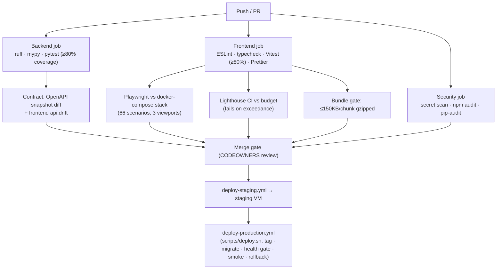

# Testing Strategy

**Scope:** Test pyramid with current inventory, accessibility and security
assurance, and the CI/CD gate chain. Performance gates:
[PERFORMANCE_REPORT.md](PERFORMANCE_REPORT.md) · security suites:
[SECURITY_POSTURE.md](SECURITY_POSTURE.md).

## 1. Test Pyramid (current inventory)

| Layer | Framework | Count | Scope |
| --- | --- | --- | --- |
| Unit (backend) | pytest | 32 test functions (`backend/tests/unit` + `security`) | Services, state machine, retention, redaction |
| Unit (frontend) | Vitest | **254 tests / 21 files** | Stores, libs (errors/logger/sanitization/security/vitals/a11y/validation), contract gaps, middleware logic, deployment contracts |
| Contract | pytest + OpenAPI snapshot | `backend/tests/contract` | Schema stability (`make api-schema`), frontend drift check (`npm run api:drift`) |
| Integration | docker-compose.test.yml | CI-parity topology | Backend against real Postgres/Redis/ES |
| End-to-end | Playwright | **66 scenarios / 9 spec files × 3 projects** (desktop, iPhone 14, Pixel 7) | Buyer/seller/funeral journeys, checkout, consent, GDPR, a11y, performance, security headers, error handling |

**Coverage gate:** ≥ 80% (lines/branches/functions) enforced in CI for
both stacks; protected modules (security, sanitization, consent, cart)
are tracked individually in `vitest.config.mts`.

**Rule of composition:** deterministic tests only — no sleeps-as-sync, no
network to third parties (Stripe mocked), seeded fixtures, and test data
cleanup in e2e (`e2e/fixtures`).

## 2. Accessibility Assurance

- **Automated:** axe-core in unit tests (`vitest-axe` on every a11y
  primitive) and in Playwright (`@axe-core/playwright` on critical pages)
  — WCAG 2.x ruleset.
- **Contract-level:** skip link first-focusable proof, focus-trap and
  announcer behavior, error-summary semantics, pagination keyboard
  operability — all unit-tested.
- **Manual:** screen-reader pass (NVDA/VoiceOver) and keyboard-only
  walkthrough of checkout, consent, and funeral journeys before each
  release; grief-adjacent flows target WCAG AAA (ADR-0009).
- **Regression:** focus indicators (2px outline/2px offset) and
  reduced-motion behavior are token-driven, so regressions surface in
  visual review, not per-component.

## 3. Security Testing

| Activity | Tooling | Cadence |
| --- | --- | --- |
| Dependency audit | Dependabot, `security.yml`, pip-tools hashes | Weekly + per PR |
| Secret scanning | `scripts/check_no_secrets.sh`, Gitleaks in CI | Every push |
| SAST | ruff (backend), ESLint `no-console: error` + typed-error boundaries (frontend) | Every push |
| Policy tests | CSP/nonce suites (`tests/security/`), e2e header suite | Every push |
| PII regression | sanitization suite (LT/LV codes, Luhn cards, UUIDs) at 100% of patterns | Every push |
| DAST + pen test | Planned third-party assessment | Annual (§5 of SECURITY_POSTURE.md) |

## 4. CI/CD Pipeline

**Gate conditions:** every box above must pass; coverage below 80%, any
budget exceedance, a secret hit, or a failing security suite blocks merge.

**Artifact retention:** coverage reports (XML + HTML), Playwright HTML
report + traces/videos on failure, Lighthouse reports — retained per
workflow policy (`.github/workflows/ci.yml`).

**Production safety:** deploys are health-gated (in-container
`/api/health`), migrations run before traffic, and every deploy tags the
previous image for one-command rollback — see
[DEPLOYMENT.md](DEPLOYMENT.md).

---

*Test file map: `frontend/tests/{unit,security,performance,lib,components,deployment}`,
`frontend/e2e/`, `backend/tests/`.*
