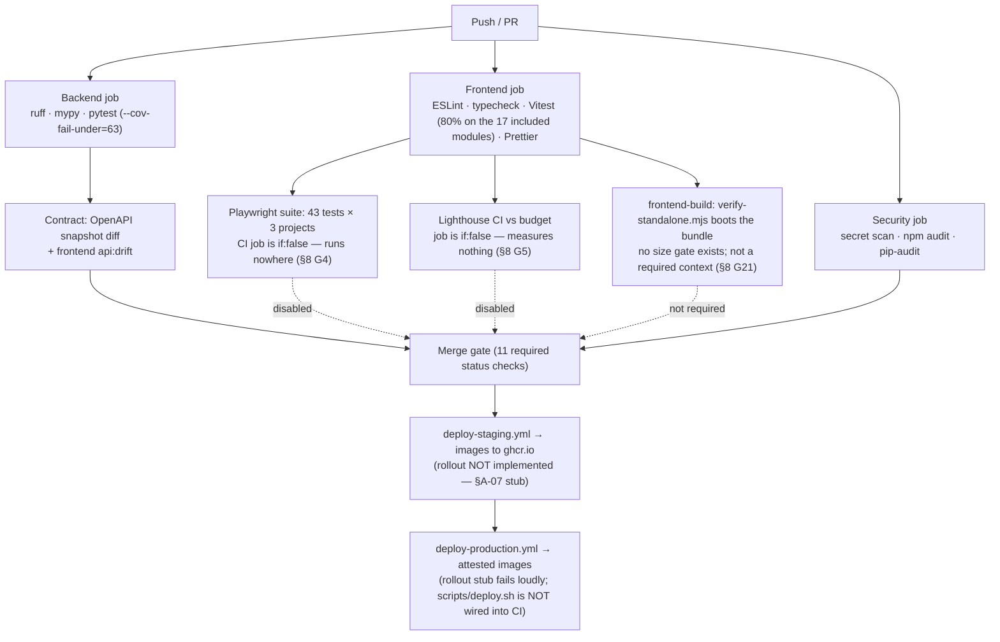

# Testing Strategy

**Scope:** Test pyramid with current inventory, accessibility and security
assurance, and the CI/CD gate chain. Performance gates:
[PERFORMANCE_REPORT.md](PERFORMANCE_REPORT.md) · security suites:
[SECURITY_POSTURE.md](SECURITY_POSTURE.md).

## 1. Test Pyramid (current inventory)

| Layer | Framework | Count | Scope |
| --- | --- | --- | --- |
| Unit (backend) | pytest | 41 tests collected (`backend/tests/unit` + `security`) | Services, state machine, retention, redaction |
| Unit (frontend) | Vitest | **267 tests / 22 files** | Stores, libs (errors/logger/sanitization/security/vitals/a11y/validation), contract gaps, middleware logic, deployment contracts |
| Contract | pytest + OpenAPI snapshot | 121 tests collected (`backend/tests/contract`) | Schema stability (`make api-schema`), frontend drift check (`npm run api:drift`) |
| Integration | docker-compose.test.yml | CI-parity topology | Backend against real Postgres/Redis/ES |
| End-to-end | Playwright | **43 `test()` declarations / 14 spec files × 3 projects** (chromium, iPhone 14, Pixel 7) | Buyer/seller/funeral journeys, checkout, consent, GDPR, a11y, performance, security headers, error handling |

Every count above is a measurement, not an aspiration, taken on 2026-10-05 against this
tree and reproducible with the command beside it: 41 → `pytest tests/unit tests/security
--collect-only -q`; 121 → `pytest tests/contract --collect-only -q`; 267/22 → `npx vitest
run` ("Test Files 22 passed", "Tests 267 passed"); 43/14 → `ls -1 frontend/e2e/*.spec.ts`
plus a `test(` count per file; 3 projects → `frontend/playwright.config.ts:53-56`. These
numbers drift on every commit and nothing verifies them, so a stale count is the expected
state — re-measure before quoting one.

**Coverage gates — two different numbers, deliberately.**

| Stack | Enforced value | Where | Applies to |
| --- | --- | --- | --- |
| Backend | `--cov-fail-under=63` | `.github/workflows/ci.yml:97` | `pytest tests/unit tests/security tests/contract --cov=.` |
| Frontend | `80` for branches, functions, lines and statements | `frontend/vitest.config.mts:55-60` | only the 17 modules named in `coverage.include` (`:36-54`) |

The backend figure is **63%, not 80%** — raised from 20 on 2026-10-06 when ADR-0021's ratchet
triggered: CI's own `backend` job reported `Total coverage: 68.56%` (run `37476183729`), so
the flag is that figure minus 5, taken from what CI reports rather than from a local run.
Measured locally the same set came out at 68.8% once contract tests joined it. The frontend
floor is real but narrow: it is not an aggregate over the app, so "the frontend is 80%
covered" does not follow from it. This table is the only place in `docs/` that states these
numbers; every other document links here rather than restating them (`QODER.md` §8 G1 — the
restatements were the drift). The 80→20 downgrade is recorded as ADR-0021, retroactively: the
value was lowered in an unrelated revert PR and had no decision record until 2026-10-05, which
is also where the ratchet rule lives. §8 G1 stays OPEN: 63% is still not the documented target.

**Rule of composition:** deterministic tests only — no sleeps-as-sync, no
network to third parties (Stripe mocked), seeded fixtures, and test data
cleanup in e2e (`e2e/fixtures`).

## 2. Accessibility Assurance

- **Automated:** axe-core in unit tests (`vitest-axe` on every a11y
  primitive) and in Playwright (`@axe-core/playwright` on critical pages)
  — WCAG 2.x ruleset.
- **Contract-level:** skip link first-focusable proof, focus-trap and
  announcer behavior, error-summary semantics, pagination keyboard
  operability — all unit-tested.
- **Manual:** screen-reader pass (NVDA/VoiceOver) and keyboard-only
  walkthrough of checkout, consent, and funeral journeys before each
  release; grief-adjacent flows target WCAG AAA (ADR-0009).
- **Regression:** focus indicators (2px outline/2px offset) and
  reduced-motion behavior are token-driven, so regressions surface in
  visual review, not per-component.

## 3. Security Testing

| Activity | Tooling | Cadence |
| --- | --- | --- |
| Dependency audit | Dependabot, `security.yml`, pip-tools hashes | Weekly + per PR |
| Secret scanning | `scripts/check_no_secrets.sh`, Gitleaks in CI | Every push |
| SAST | ruff (backend), ESLint `no-console: error` + typed-error boundaries (frontend) | Every push |
| Policy tests | CSP/nonce suites (`tests/security/`), e2e header suite | Every push |
| PII regression | sanitization suite (LT/LV codes, Luhn cards, UUIDs) at 100% of patterns | Every push |
| DAST + pen test | Planned third-party assessment | Annual (§5 of SECURITY_POSTURE.md) |

## 4. CI/CD Pipeline

```mermaid
flowchart TD
    PR["Push / PR"] --> BE["Backend job<br/>ruff · mypy · pytest (--cov-fail-under=63)"]
    PR --> FE["Frontend job<br/>ESLint · typecheck · Vitest (80% on the 17 included modules) · Prettier"]
    PR --> SEC["Security job<br/>secret scan · npm audit · pip-audit"]
    BE --> CT["Contract: OpenAPI snapshot diff<br/>+ frontend api:drift"]
    FE --> E2E["Playwright suite: 43 tests × 3 projects<br/>CI job is if:false — runs nowhere (§8 G4)"]
    FE --> LH["Lighthouse CI vs budget<br/>job is if:false — measures nothing (§8 G5)"]
    FE --> BA["frontend-build: verify-standalone.mjs boots the bundle<br/>no size gate exists; not a required context (§8 G21)"]
    CT --> MERGE["Merge gate (11 required status checks)"]
    E2E -.->|disabled| MERGE
    LH -.->|disabled| MERGE
    BA -.->|not required| MERGE
    SEC --> MERGE
    MERGE --> STG["deploy-staging.yml → images to ghcr.io<br/>(rollout NOT implemented — §A-07 stub)"]
    STG --> PROD["deploy-production.yml → attested images<br/>(rollout stub fails loudly; scripts/deploy.sh is NOT wired into CI)"]
```

**Gate conditions:** the eleven required contexts are `backend`, `secrets`,
`frontend-typecheck`, `frontend-lint`, `frontend-unit`, `frontend-openapi-drift`,
`gitleaks`, `trivy`, `codeql`, `dependency-audit` and `docker-scan`. What therefore
blocks a merge: backend coverage under the `--cov-fail-under` value, a frontend drop
below the 80% floor on the included modules, a failing frontend test, type check or
lint, OpenAPI drift, a secret hit, or a failing security suite. The three dotted boxes
above **do not** block — Lighthouse and Playwright are `if: false` (§8 G5, §8 G4) and
`frontend-build` is not a required context and holds the only check that boots the shipped
bundle (§8 G21). It no longer waits on lint: on 2026-10-06 PR #176 dropped `frontend-lint`
from the job's `needs:`, so a lint failure can no longer suppress it — measured the same day on
PR #161, where `frontend-lint` failed and `frontend-build` ran and passed on the same commit.
Making `frontend-build` a required context (G21's fix 2) is still open and is the owner's call.

**Artifact retention:** coverage reports (XML + HTML), Playwright HTML
report + traces/videos on failure, Lighthouse reports — retained per
workflow policy (`.github/workflows/ci.yml`).

**Production safety — described in the deployment docs, not implemented in any
workflow.** Neither deploy workflow performs a rollout: `deploy-production.yml:57-62`
is a `TODO(A-07)` step that prints "migration job → rollout → smoke → rollback tag
record" and then exits 1, while `deploy-staging.yml` emits a warning and exits 0 having
deployed nothing (§8 G17). So no migration runs before traffic, no deploy exercises a
health gate, and no rollback tag is recorded. What the workflows do is build and push
images — production pushes `:latest` — which is why a green production run must never be
read as a release. The health-gated rollout and one-command rollback in
[DEPLOYMENT.md](DEPLOYMENT.md) remain design, pending `docs/ASSUMPTIONS.md` §A-07.

---

*Test file map: `frontend/tests/{unit,security,performance,lib,components,deployment}`,
`frontend/e2e/`, `backend/tests/`.*
