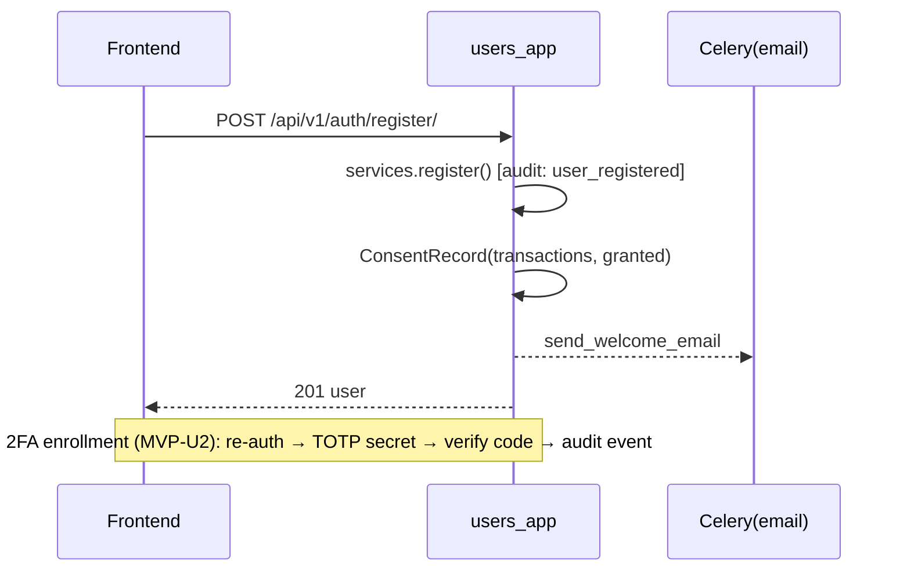

# 02 — Sequence: registration + 2FA

```mermaid
sequenceDiagram
    participant FE as Frontend
    participant API as users_app
    participant Q as Celery(email)
    FE->>API: POST /api/v1/auth/register/
    API->>API: services.register() [audit: user_registered]
    API->>API: ConsentRecord(transactions, granted)
    API-->>Q: send_welcome_email
    API-->>FE: 201 user
    Note over FE,API: 2FA enrollment (MVP-U2): re-auth → TOTP secret → verify code → audit event
```
