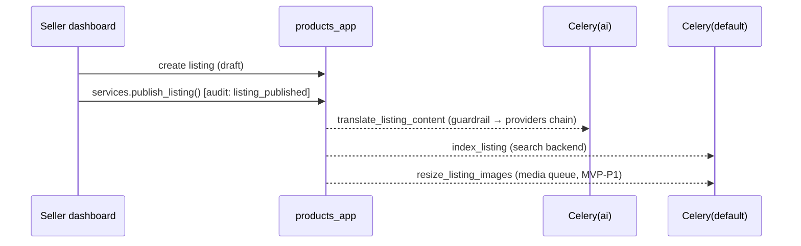

# 03 — Sequence: listing creation → publish

```mermaid
sequenceDiagram
    participant S as Seller dashboard
    participant P as products_app
    participant AI as Celery(ai)
    participant SR as Celery(default)
    S->>P: create listing (draft)
    S->>P: services.publish_listing() [audit: listing_published]
    P-->>AI: translate_listing_content (guardrail → providers chain)
    P-->>SR: index_listing (search backend)
    P-->>SR: resize_listing_images (media queue, MVP-P1)
```
