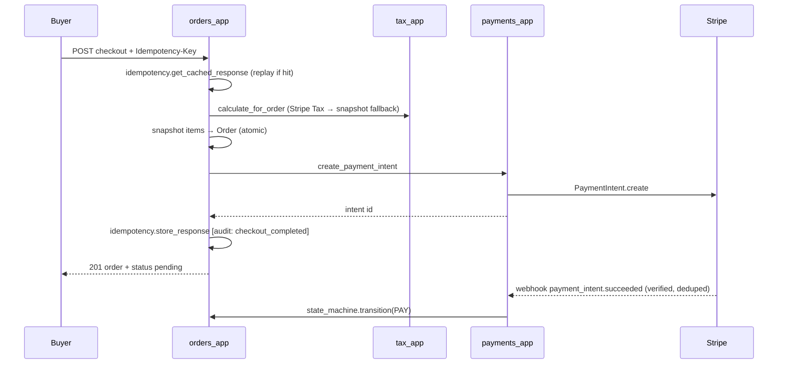

# 04 — Sequence: checkout (money path)

```mermaid
sequenceDiagram
    participant B as Buyer
    participant O as orders_app
    participant T as tax_app
    participant P as payments_app
    participant ST as Stripe
    B->>O: POST checkout + Idempotency-Key
    O->>O: idempotency.get_cached_response (replay if hit)
    O->>T: calculate_for_order (Stripe Tax → snapshot fallback)
    O->>O: snapshot items → Order (atomic)
    O->>P: create_payment_intent
    P->>ST: PaymentIntent.create
    P-->>O: intent id
    O->>O: idempotency.store_response [audit: checkout_completed]
    O-->>B: 201 order + status pending
    ST-->>P: webhook payment_intent.succeeded (verified, deduped)
    P->>O: state_machine.transition(PAY)
```
