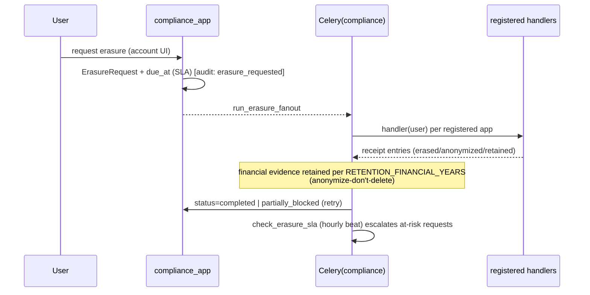

# 05 — Sequence: GDPR erasure (Art. 17)

```mermaid
sequenceDiagram
    participant U as User
    participant C as compliance_app
    participant Q as Celery(compliance)
    participant APPS as registered handlers
    U->>C: request erasure (account UI)
    C->>C: ErasureRequest + due_at (SLA) [audit: erasure_requested]
    C-->>Q: run_erasure_fanout
    Q->>APPS: handler(user) per registered app
    APPS-->>Q: receipt entries (erased/anonymized/retained)
    Note over Q: financial evidence retained per RETENTION_FINANCIAL_YEARS<br/>(anonymize-don't-delete)
    Q->>C: status=completed | partially_blocked (retry)
    Q->>Q: check_erasure_sla (hourly beat) escalates at-risk requests
```
