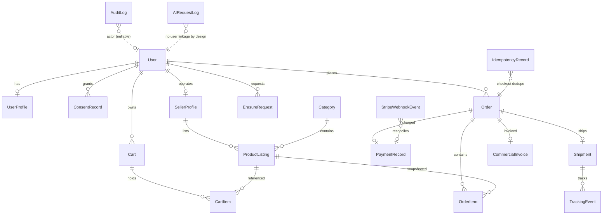

# 06 — Database ERD (logical)

**pgcrypto/encryption annotations:** `UserProfile.full_name|phone|date_of_birth|street_address`
→ `EncryptedTextField` (Fernet, `pii_classification` per field; see COMPLIANCE_MATRIX).
